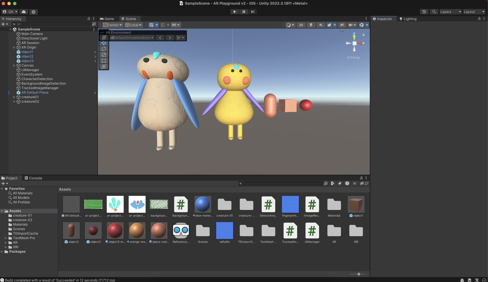

# XR Workshop WS24/25

## Project concept

This XR project is inspired by the idea of creating an illustrated children's book that combines real and virtual elements. The concept includes a physical book with text and illustrations, enhanced by an AR layer that adds interactive features while reading the story. The virtual layer would complement the physical one, creating (hopefully) a seamless immersive experience.

Since I’ve never worked with Unity or XR technologies before, I used this workshop as an opportunity to focus on small prototypes to test parts of this idea. The goal was to explore key aspects of the concept and create proof-of-concept features for a potential larger project in the future.

_Due to time constraints, I am submitting my prototype earlier than the deadline. The submission includes: the project folder `iOSBuild01` and the showcase video._

## The prototypes

### Tiny UI

To get familiar with UI elements, I worked on creating menus with buttons and text. These are essential parts of any app. My script, `UIManager.cs`, manages interactions across the app. The main focus was to:

- Let users select an option from the menu.
- Ensure the app tracks or stops tracking the correct images based on the selected option.
- Destroy elements from the previously selected option when returning to the main menu.

### Selecting a character

Using the provided prototype sheet, I placed two blocks as markers. My script, `DetectAndSelect.sc`, detects these markers and places a character on each of them.

### "Planting" flowers

This prototype is in the `BackgroundImageDetection.cs` script. The idea was to simulate planting flowers in a specific area of the tracked image (the “flower field”) as part of the story.

While I couldn’t create flower objects due to time constraints, I implemented the interaction using cubes (single tap) and capsules (double tap). This prototype was the most challenging as I needed to:

- Restrict interactions to the borders of the tracked image.
- Differentiate between single and double taps.

Currently, the interaction requires the user to:

- Move the phone to detect a plane (e.g., a table beneath the tracked image).
- Ensure the detected plane fully covers the tracked image before tapping.

This is shown also in my preview.

### Creatures

I also experimented with creating my own creatures in Blender. I’ve always wanted to learn Blender but never found the time, so I saw this as a great opportunity to start. I really enjoyed working on this, even though it was challenging.

I designed “clay-like” creatures, but struggled with exporting textures to Unity. After watching many tutorials, I got partial results, but my creatures look quite different (and uglier 😀) in Unity compared to Blender.

Despite this, I’m happy I took the first step into Blender and learned a lot from the process.

## Lessons learned

- __Image Tracking:__ Enter the physical size of the tracked image in Unity as accurately as possible to the real-world size.

- __Reference Images:__ Good tracking requires high-contrast, textured images with clear edges, printed on flat, non-glossy surfaces.

- __Blender to Unity:__ Pay attention to UV unwrapping, baking textures, and exporting materials (e.g., normal maps) correctly.

- __Coordinate Systems:__ Blender and Unity use different coordinate systems—this can affect object orientation during import/export.

### Some known bugs

- Somehow the yellow character appears not facing towards the camera when its tracked image is correctly positioned. If the tracked image is rotated like in the demo, the character is appearing correctly. I believe this is due to wrong export from Blender and because of time constraints, I have not investigated this further.

- It is better to first choose the "Select character" option to better see the character, because once the helper plane is activated in the "Plant flowers" option, it does not disappear, therefore the app has to be started again.

## Links

Build & Demo:
[link](https://drive.google.com/drive/folders/1-qQyn3u-wSGds39CxZ3kfKGv-XTjTZl7?usp=sharing)
