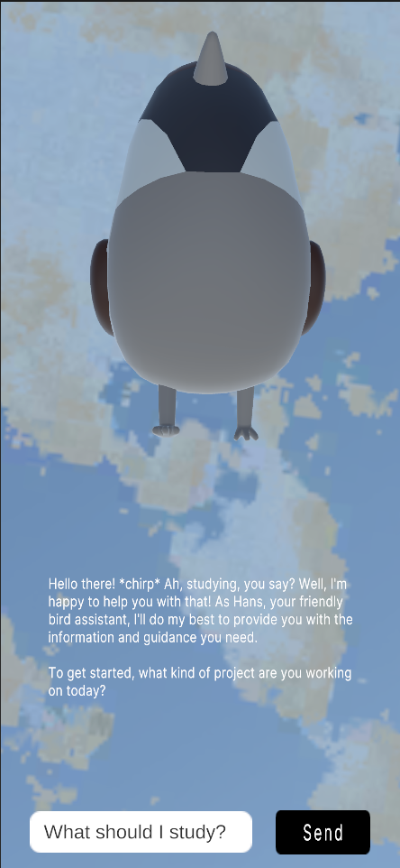

# CTech Maskottchen

Meet our little CTech Maskottchen – your friendly assistant in the CTech world! As soon as you open the app, you'll see her flying around, ready to answer your questions about the course, provide helpful information, and even offer a bit of emotional support along the way.

 

### Our setup 

We used the Unity template AR Mobile Core which we then adapted by adding a 2 Unity packages and wrote two additional scripts. The first package is called Quirky Series Ultimate where we used the Sparrow character and the second package is called LLMUnity where we used the model Llama 3.2 1B. The scripts we then added are 'Bird Behaviour' which controls the movement and animation of the bird and 'LLM Behaviour' which controls the input and response of the LLM. 

### Our challenges

The main challenge we encountered is that the LLM would not run on our iphone due to hardware issues. In future, we want to try and get the remote version to work but unfortunately, we did not have enough time to implement it. However, it was able to run in the game view on our mac's so we are hopeful that with some more time and understanding we will be able to run it on an iphone. 

We also tried to create a new bird character from scratch but we were not able to implement it in the time frame. Here is what it is looking like so far: 

### Future ideas 

We would like to present this at the Sehsuchte festival as a little bird that tells people more about CTech in general since people are still very confused by the course. Therefore, we will try and solve the challenges mentioned above before then. 

You can download our ipa and watch a video of the game play [here](https://owncloud.gwdg.de/index.php/s/XH7IlIetF31rPEB) 

