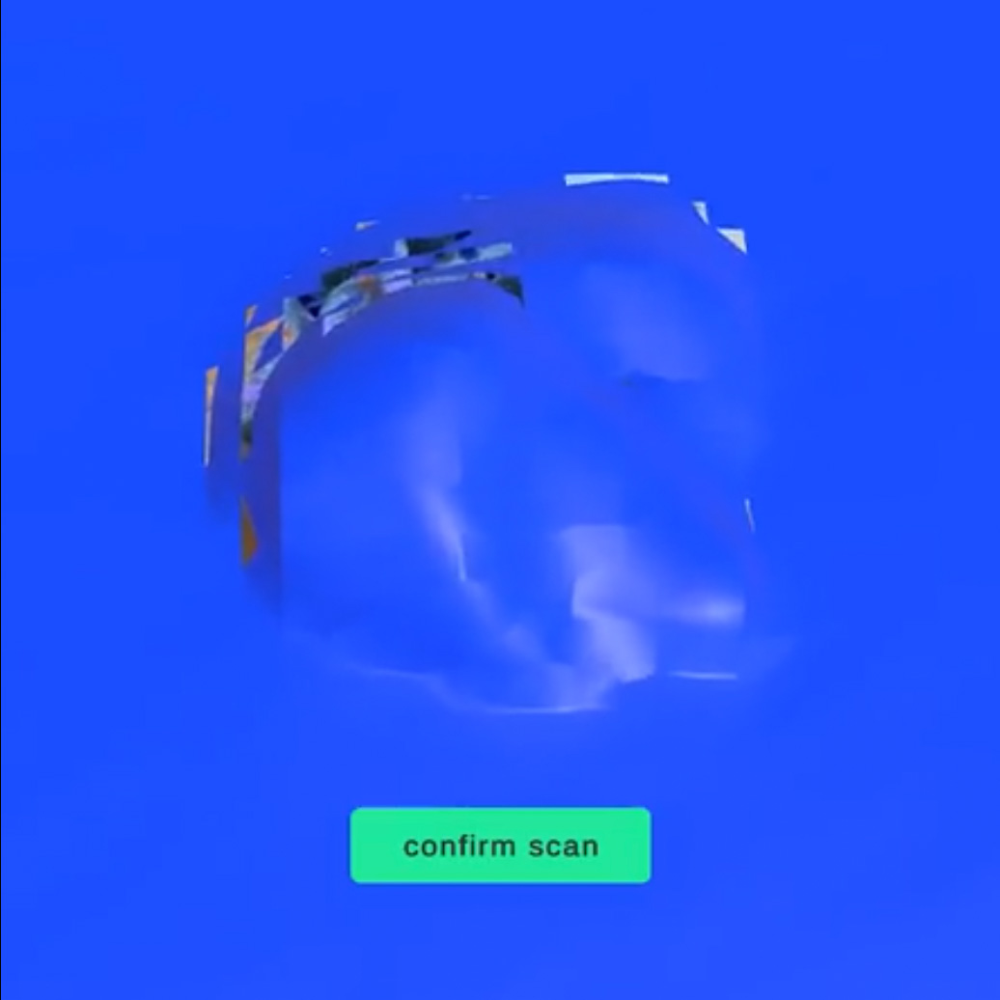
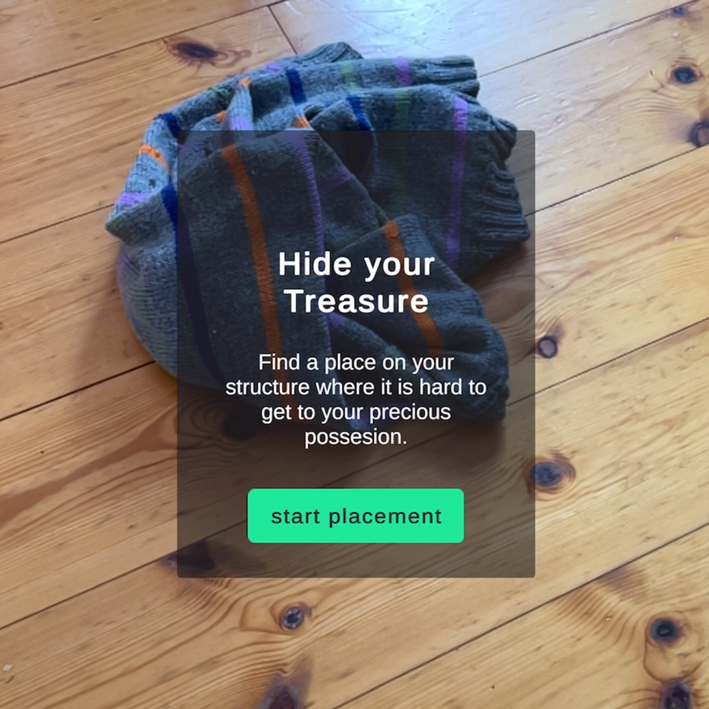
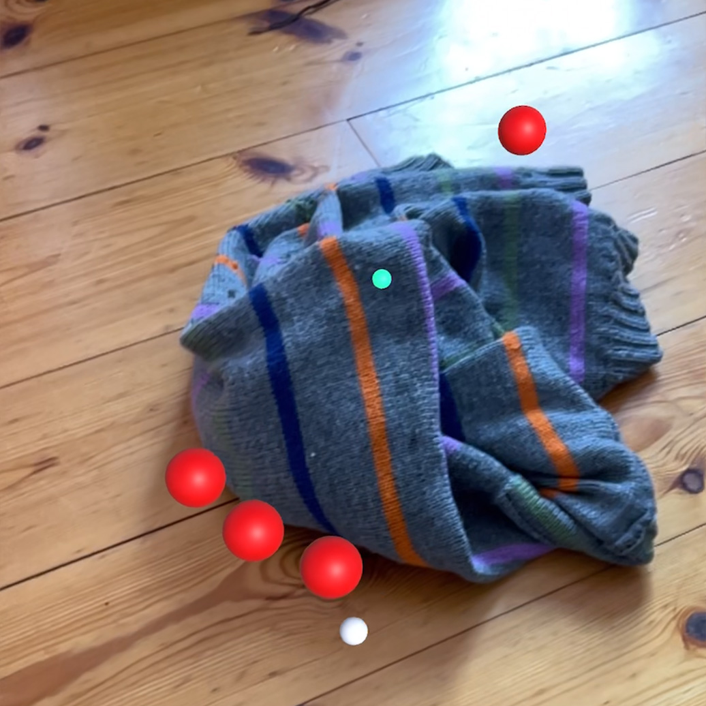
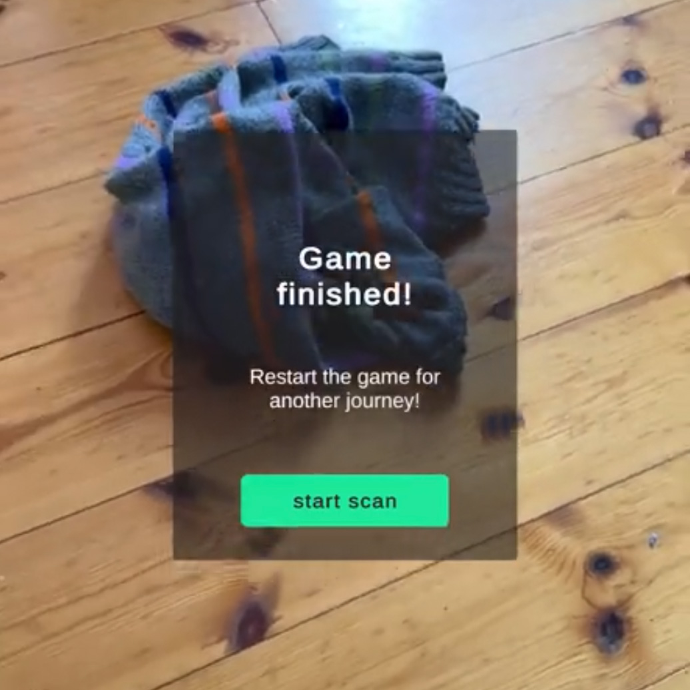

# Towar

by Gorm Labenz & Philip Gerdes

> In Towar, a physically built fortress serves as the playing ground for a virtual defense battle. Whether it's a sandcastle on the beach, a pillow fort in the living room or a house of cards on the table, any real environment can serve as terrain. Players hide a virtual treasure in their self-built structure and defend it against advancing threats. Armed with their smartphone as a bow, the aim is to hit all enemies before they can reach their bounty.

## Game Mechanics

### Concept

- Players build a _physical_ structure to defend
- _Virtual_ treasure is placed onto the tower
- _Virtual_ opponents try to capture the treasure
- The player defends the treasure with AR controlled archery

Primarily this concept engages with the idea of intertwining the physical and the virtual in an interactive way. Bridging the gap between both allows for a more immersive experience while moving past a simple scene tracking approach. The physical built process, being a part of the game-play, involves players more into the scene, while making the stakes more emotionally tangible.

### Defense System

The smartphone acts as a virtual bow

- Players can fire arrows in the direction of sight through the camera
- Enemies are eliminated after three hits

### Game Objectives

- **Victory**: Eliminate all attackers before losing the treasure
- **Defeat**: One attacker reaches the treasure

## Technical Implementation

### AR Scanning

Through the ARKit framework

- [x] Lidar for a more detailed and quicker environment mesh estimation (iOS build only on supported devices)
- [x] Live tracking of the AR Session

### Enemy AI

- [x] Spawn on outer radius around the placed treasure
- [x] Targeted movement to the treasure
- [x] trigger radius around treasure for loss of game

### Bow and Arrow Mechanic

- [x] Projectile is fired in direction of sight

### User Interface

- [x] Initialization Walkthrough
- [x] Outcome and Restart

## Game Sequence

1. **Preparation Phase**

   - Scanning of the environment by the player
     
   - Placement of the virtual treasure
     

2. **Defense Phase**
   

   - Enemies spawn at a defined distance from the treasure
   - Movement of the enemies across the mesh
   - Active defense by the player

3. **Outcome**
   
   - Victory condition: Elimination of all opponents
   - Loss condition: treasure is reached

## Deliverables

### Walkthrough

> right-click to play video in new window

### Build

[Download from Google Drive](https://drive.google.com/file/d/1XgSymJDPc3oIBiXbe0GSjxy24rY31WV9/view?usp=drive_link)
